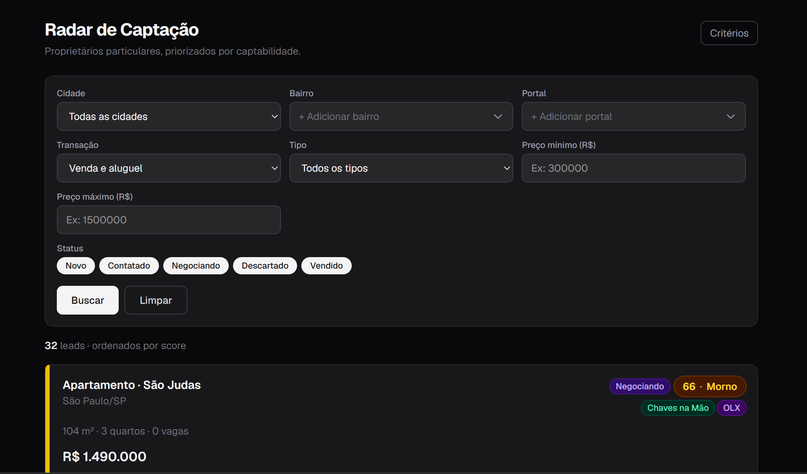
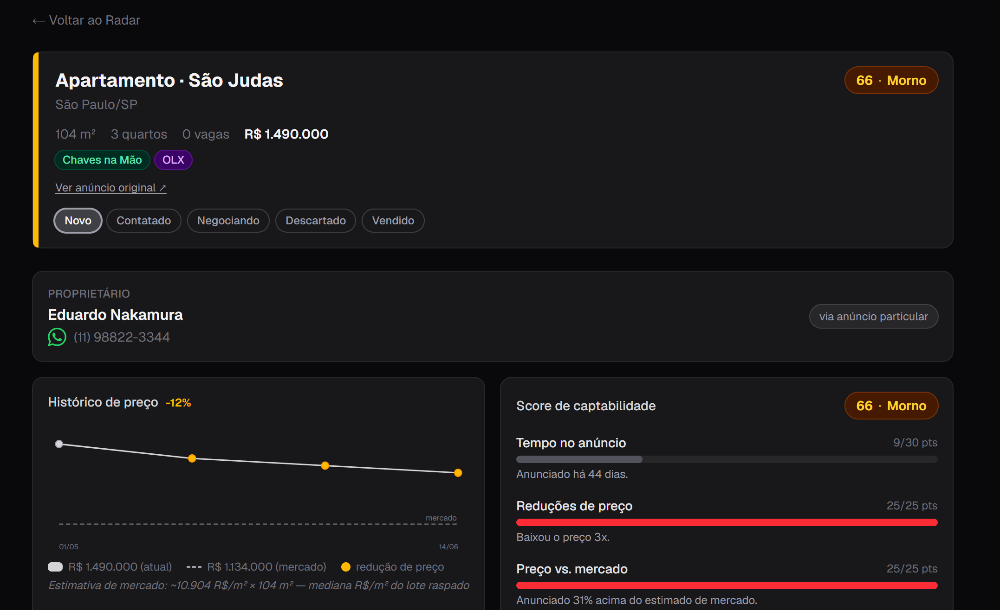
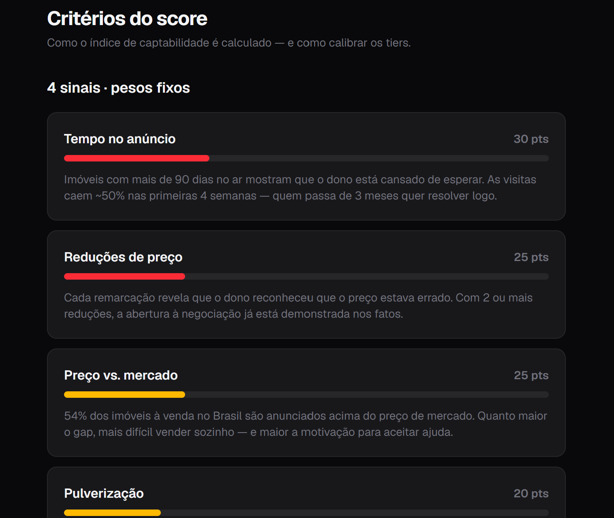

# 📡 Radar de Captação

> Protótipo de hackathon da **Lastro** — um painel que encontra proprietários
> anunciando o próprio imóvel ("particular" / FSBO) nos portais, os **prioriza por
> uma fila de captabilidade explicável** e usa **Claude** para escrever o briefing
> de abordagem do corretor.

A IA **nunca fala com o proprietário** — ela arma o corretor. Não é uma lista
telefônica plana: é uma **fila priorizada + explicável + pitch ancorado em dado**.

🎥 **Demo (YouTube):** https://youtu.be/4nq2QFmWTPk


🚀 **Deploy (Vercel):** https://lastro-hackathon-phi.vercel.app/

---

## ✨ O que ele faz

- **Fila priorizada** de proprietários particulares, ordenada por um **score de
  captabilidade 0–100** — determinístico e explicável (não sai do LLM).
- **Briefing de abordagem por lead** gerado pela **Claude**: por que abordar agora,
  qual alavanca puxar, **mensagem de WhatsApp pronta** (LGPD-aware) e a objeção
  provável.
- **Critérios calibráveis**: os sinais e pesos do score são transparentes e os
  cortes de tier (frio / morno / quente) são editáveis ao vivo.
- **Dado honesto**: os scrapers só guardam o que o portal expõe de verdade — nada de
  proprietário/telefone/histórico fabricado. A única exceção é `data/olx-mock.json`
  (a OLX bloqueia scraping).

---

## 🖼️ Telas

### Fila priorizada
Filtros multi-bairro/portal + leads ordenados por score, com tier e portais de origem.



### Ficha do lead + briefing IA
Contato do proprietário, histórico de preço, breakdown do score sinal a sinal e o
briefing de abordagem com deeplink de WhatsApp.



### Critérios do score
Os 4 sinais e seus pesos, com explicação de cada um e cortes de tier calibráveis.



---

## 🧮 Como o score funciona

Quatro sinais ponderados somam **100 pontos** ([lib/score.ts](lib/score.ts)). O score é
**determinístico** — estável pro demo; a Claude só **explica o porquê**, não o calcula.

| Sinal | Peso | Leitura |
|---|---|---|
| **Tempo no anúncio** | 30 | Dono há muito tempo no ar está cansado de esperar |
| **Reduções de preço** | 25 | Cada remarcação admite que o preço estava errado |
| **Preço vs. mercado** | 25 | Quanto maior o gap acima do mercado, mais difícil vender sozinho |
| **Pulverização** | 20 | Mesmo imóvel espalhado em vários portais/anunciantes |

**Tiers:** `quente` ≥ 66 · `morno` ≥ 40 · `frio` < 40.

---

## 🧱 Stack

- **[Next.js 16.2.9](https://nextjs.org)** full-stack (App Router, Route Handlers) + **React 19**
- **TypeScript** (strict)
- **Tailwind CSS v4**
- **[Claude](https://www.anthropic.com)** via `@anthropic-ai/sdk` — `messages.parse()` + `zodOutputFormat` (saída estruturada com Zod)
- **[Neon](https://neon.tech)** (Postgres serverless) + **Drizzle ORM**
- **Cheerio** para os scrapers (Chaves na Mão / SP Imóvel)

A lógica de negócio vive em `lib/` (a fundação estável); data, rotas de API e UI são
construídas em cima dela.

---

## 🚀 Como rodar

**Pré-requisitos:** Node 18+ e npm.

```bash
# 1. instalar dependências
npm install

# 2. configurar variáveis de ambiente (veja a seção abaixo)
cp .env.example .env
# edite .env com suas chaves

# 3. subir o dev server
npm run dev
```

Abra **http://localhost:3000**.

> 💡 **Funciona sem nenhuma chave.** Sem `NEON_POSTGRES_CONNECTION_STRING` o app lê do
> snapshot offline `data/leads.json`; sem `ANTHROPIC_API_KEY` o briefing cai num
> fallback determinístico (`fonte: "fallback"`). O demo **nunca** depende de API
> externa pra abrir.

### Build de produção

```bash
npm run build
npm run start
```

---

## 🔑 Variáveis de ambiente (`.env`)

Copie `.env.example` para `.env` e preencha o que quiser usar. **Todas são opcionais** —
o app degrada com elegância sem elas.

| Variável | Obrigatória? | Para quê |
|---|---|---|
| `ANTHROPIC_API_KEY` | Não | Liga o briefing **real** da Claude. Sem ela, usa fallback determinístico. |
| `CLAUDE_MODEL` | Não | Sobrescreve o modelo (default `claude-haiku-4-5`; use `claude-opus-4-8` pra mais qualidade). |
| `NEON_POSTGRES_CONNECTION_STRING` | Não | Conexão Neon Postgres. Sem ela, `lib/data.ts` lê de `data/leads.json`. ⚠️ O nome é **exatamente** esse — não `DATABASE_URL`. |

```env
ANTHROPIC_API_KEY=
CLAUDE_MODEL=
NEON_POSTGRES_CONNECTION_STRING=
```

---

## 📦 Scripts disponíveis

```bash
npm run dev          # dev server em http://localhost:3000
npm run build        # build de produção
npm run start        # serve o build de produção
npm run lint         # eslint (next/core-web-vitals + typescript)

# banco (Neon) — precisa de NEON_POSTGRES_CONNECTION_STRING
npm run db:push      # aplica o schema Drizzle no Neon
npm run db:reset     # zera todas as tabelas (sem repopular)
npm run db:studio    # abre o Drizzle Studio

# dados (invariante: só olx-mock.json é não-real)
npm run scrape:cnm   # scrape real do Chaves na Mão → upsert no Neon
npm run scrape:spi   # scrape real do SP Imóvel → upsert no Neon
npm run ingest:olx   # ingere data/olx-mock.json (o ÚNICO dado não-real)
npm run export:leads # snapshot do DB honesto → data/leads.json (fallback offline)
```

**Para popular o banco do zero:** `db:reset` → `scrape:cnm` → `scrape:spi` → `ingest:olx`.

> Não há test runner — `lib/` é validado por inspeção. Type-check via `npx tsc --noEmit`.

---

## 🗂️ Estrutura

```
app/                  # App Router — telas + route handlers
  page.tsx            # Tela A — fila priorizada
  lead/[id]/page.tsx  # Tela B — ficha do lead + briefing
  criterios/page.tsx  # Tela D — critérios e cortes
  api/                # /search, /lead/[id], /briefing, /lead/[id]/status
lib/                  # núcleo de negócio (a fundação estável)
  types.ts            # contratos do domínio (Lead, LeadComScore, ...)
  score.ts            # score determinístico e explicável (0–100)
  data.ts             # leitura/filtro de leads (Neon ou leads.json)
  anthropic.ts        # gerarBriefing() — Claude com saída estruturada
  format.ts           # helpers de UI (brl, WhatsApp deeplink, ...)
  db/                 # schema Drizzle + client Neon
components/           # componentes de UI
scripts/              # scrapers + ingest + reset + export
data/                 # leads.json (fallback) + olx-mock.json (único não-real)
```

---

## ⚠️ Notas

- O domínio e toda a copy de interface estão em **português** — mantenha a consistência.
- Esta versão do Next.js (**16.2.9**) tem breaking changes vs. releases antigas;
  consulte `node_modules/next/dist/docs/` antes de mexer em App Router / route handlers.
- `ROADMAP.md` é a fonte da verdade de escopo e decisões travadas.

---

Feito com ☕ no hackathon da **Lastro**.
